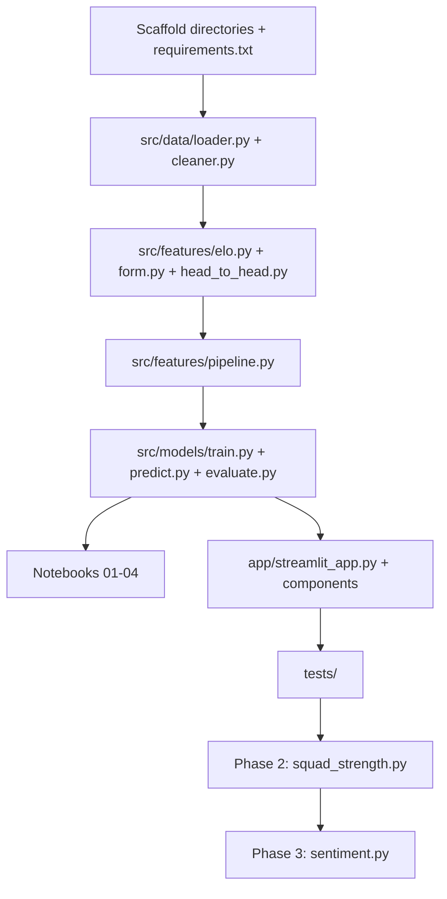

# PitchIQ — FIFA Match Outcome Predictor: Implementation Plan

## Overview

PitchIQ is a machine learning project that predicts international football match outcomes (Win / Draw / Loss from the home team's perspective) using historical FIFA match data, engineered features, and interpretable classification models. The project is exposed via a Streamlit web application.

The repository currently contains only the `README.md`, `.gitignore`, and `LICENSE`. Everything else needs to be built from scratch.

---

## Open Questions

> [!IMPORTANT]
> Please review the following before I start coding:

1. **Historical cutoff year** — The README mentions removing early matches to reduce noise. What year should we use as the minimum cutoff? (Common choices: 1950, 1970, 1990.)
2. **Primary model** — Should I prioritize XGBoost/LightGBM, or start with Logistic Regression + Random Forest for the initial working version?
3. **Phase scope** — Should I implement all three phases now, or deliver Phase 1 (core model + Streamlit app) first and then iterate?
4. **Dataset availability** — Do you already have the Kaggle datasets downloaded locally, or should I include a setup script to download them automatically via the Kaggle API?
5. **Deployment target** — The README mentions FastAPI + cloud deployment as a future step. Is that in scope for now, or just the Streamlit app?

---

## Proposed Changes

### Phase 1 — Core ML Pipeline + Streamlit App

---

#### [NEW] `requirements.txt`

Core Python dependencies:

```
pandas>=2.0
numpy>=1.24
scikit-learn>=1.4
xgboost>=2.0
lightgbm>=4.0
shap>=0.44
streamlit>=1.32
plotly>=5.20
joblib>=1.3
jupyter>=1.0
ipykernel>=6.0
kaggle>=1.6
```

---

#### Project Scaffolding — Directories

```
data/raw/
data/processed/
data/external/
notebooks/
src/data/
src/features/
src/models/
src/utils/
app/components/
app/assets/
models/
tests/
```

---

### Component 1 — Data Layer (`src/data/`)

#### [NEW] `src/data/loader.py`

Responsible for loading raw CSVs into DataFrames with type enforcement and column validation.

- `load_results(path)` — loads `results.csv`, parses `date` as datetime
- `load_players(path)` — loads Transfermarkt `players.csv`
- `load_rankings(path)` — loads FIFA ranking data if available

#### [NEW] `src/data/cleaner.py`

Responsible for cleaning and preparing the base match dataset.

- Filter rows with null scores
- Standardize team name strings (e.g., "United States" vs "USA")
- Apply historical cutoff filter (configurable year)
- Encode target: `home_score > away_score` → Win (1), equal → Draw (0), else Loss (-1)
- Save cleaned dataset to `data/processed/matches_cleaned.csv`

---

### Component 2 — Feature Engineering (`src/features/`)

#### [NEW] `src/features/form.py`

Computes rolling form features for each team over the last 5 and 10 matches:

- `home_win_rate_5`, `home_draw_rate_5`, `home_loss_rate_5`
- `home_goals_scored_avg_5`, `home_goals_conceded_avg_5`
- Same set for 10-match windows
- Mirrored set for the away team
- Winning/losing streak indicators

> [!NOTE]
> Must be computed from chronologically sorted data per team to avoid data leakage. Rolling windows look only at matches *before* the current one.

#### [NEW] `src/features/head_to_head.py`

For each match, computes aggregated historical stats from *prior* meetings between the two teams:

- `h2h_home_win_rate` — home team's win rate in past H2H encounters
- `h2h_avg_goal_diff` — average goal difference in prior meetings
- `h2h_num_meetings` — total prior encounters (used as confidence weight)

#### [NEW] `src/features/elo.py`

Builds an Elo rating system from scratch over the full match history:

- Initializes all teams at 1500 Elo
- Updates ratings after each match using K-factor = 32 (configurable)
- Extracts `home_elo_before`, `away_elo_before`, `elo_diff` for each match
- Accounts for neutral venue (no home advantage bonus on neutral ground)

#### [NEW] `src/features/squad_strength.py` *(Phase 2)*

Integrates Transfermarkt player data:

- Aggregates squad market value per national team per year
- Computes `home_squad_value`, `away_squad_value`, `squad_value_diff`
- Positional breakdown: attacking vs. defensive value ratio

#### [NEW] `src/features/pipeline.py`

Orchestrator that runs all feature modules in sequence and merges outputs into a single feature matrix:

- Calls `cleaner.py` → `form.py` → `head_to_head.py` → `elo.py`
- Handles merging on `(date, home_team, away_team)` key
- Saves final feature matrix to `data/processed/features.csv`

---

### Component 3 — Modeling (`src/models/`)

#### [NEW] `src/models/train.py`

- Loads `data/processed/features.csv`
- Temporal train/test split (most recent N years held out as test set)
- Trains three models: Logistic Regression, Random Forest, XGBoost
- 5-fold time-series cross-validation on training set
- Selects best model by macro F1 score
- Serializes best model to `models/best_model.pkl`
- Saves feature column list to `models/feature_columns.json`

#### [NEW] `src/models/predict.py`

- Loads serialized model and feature schema
- `predict_match(home_team, away_team, tournament_type, date)` → returns dict with:
  - `outcome` (Win/Draw/Loss label)
  - `probabilities` dict (Win %, Draw %, Loss %)
  - `top_features` list (SHAP values for top 5 features)

#### [NEW] `src/models/evaluate.py`

- Loads test set predictions
- Computes: Accuracy, Macro F1, Per-class P/R/F1, Confusion Matrix, Brier Score, Log Loss
- Generates probability calibration curve
- Prints and saves evaluation report to `models/evaluation_report.json`

---

### Component 4 — Notebooks (`notebooks/`)

#### [NEW] `notebooks/01_data_exploration.ipynb`

- Distribution of outcomes (Win/Draw/Loss)
- Timeline of matches per decade
- Top teams by win rate
- Missing data analysis

#### [NEW] `notebooks/02_feature_engineering.ipynb`

- Visual walkthrough of rolling form computation
- Elo rating evolution for selected teams over time
- Feature correlation heatmap
- Distribution plots for each engineered feature

#### [NEW] `notebooks/03_model_training.ipynb`

- Training all three models
- Cross-validation results table
- Hyperparameter tuning exploration

#### [NEW] `notebooks/04_model_evaluation.ipynb`

- Test set metrics for the best model
- Confusion matrix visualization
- Reliability diagram (probability calibration)
- Feature importance ranking (SHAP summary plot)

---

### Component 5 — Streamlit App (`app/`)

#### [NEW] `app/streamlit_app.py`

Main application entry point:

- Page config: wide layout, dark theme, custom favicon
- Sidebar: About section, data source credits
- Main area:
  - **Team Selection Panel** — two `st.selectbox` dropdowns for Home/Away team
  - **Tournament Type** — `st.selectbox` (World Cup, Friendly, Continental, Other)
  - **Predict button** — triggers `predict_match()` from `src/models/predict.py`
  - **Results Panel** — outcome label, probability bar chart (Plotly), feature attribution panel

#### [NEW] `app/components/prediction_card.py`

Renders the prediction result:
- Win/Draw/Loss badge with color coding (green/yellow/red)
- Horizontal stacked bar chart of Win/Draw/Loss probabilities (Plotly)

#### [NEW] `app/components/feature_attribution.py`

Renders the top contributing features:
- Horizontal bar chart of SHAP values
- Positive contributions in teal, negative in orange

#### [NEW] `app/components/h2h_table.py`

Renders historical head-to-head summary:
- Last 5 encounters (date, home score, away score, tournament)
- Win/Draw/Loss tally badge

---

### Component 6 — Tests (`tests/`)

#### [NEW] `tests/test_features.py`

- Unit tests for form feature computation (checks no future data leakage)
- Unit tests for Elo update logic
- Unit tests for H2H aggregation correctness

#### [NEW] `tests/test_models.py`

- Checks that `predict_match()` returns expected keys
- Validates probability outputs sum to ~1.0
- Smoke test: run full pipeline on a small synthetic dataset

---

### Component 7 — Utilities

#### [NEW] `src/utils/helpers.py`

- `normalize_team_name(name: str) -> str` — standardizes team name strings
- `tournament_to_weight(tournament: str) -> float` — maps tournament type to Elo K-factor multiplier
- `temporal_train_test_split(df, cutoff_year)` — returns (train_df, test_df)

#### [NEW] `.env.example`

```
KAGGLE_USERNAME=your_kaggle_username
KAGGLE_KEY=your_kaggle_api_key
```

---

## Phase 2 — Player Strength Integration

> [!NOTE]
> Phase 2 adds Transfermarkt squad data. This extends `src/features/squad_strength.py` (already scaffolded) and retrains the model with additional features.

**Changes:**
- `src/features/squad_strength.py` — implement squad aggregation logic
- `src/features/pipeline.py` — add squad strength features to the merge step
- `src/models/train.py` — add squad features to the feature column list
- `notebooks/02_feature_engineering.ipynb` — add squad strength analysis section

---

## Phase 3 — Sentiment Analysis *(Optional)*

> [!NOTE]
> Phase 3 adds pre-match sentiment signals from news/social media using a Hugging Face transformer.

**New files:**
- `src/features/sentiment.py` — scrape/load headlines, run through `cardiffnlp/twitter-roberta-base-sentiment` pipeline, output team-level sentiment scores
- Requires: `transformers`, `torch`, `requests` added to `requirements.txt`

---

## Verification Plan

### Automated Tests

```bash
# Install dependencies
pip install -r requirements.txt

# Run unit tests
pytest tests/ -v

# Run full data pipeline
python src/data/cleaner.py
python src/features/pipeline.py

# Train model
python src/models/train.py

# Evaluate model
python src/models/evaluate.py

# Launch Streamlit app
streamlit run app/streamlit_app.py
```

### Notebook Verification

Run all four notebooks end-to-end and confirm:
- `01` — plots render without errors
- `02` — features contain no NaNs after engineering
- `03` — all three models train and cross-validate
- `04` — evaluation report matches `models/evaluation_report.json`

### Manual Streamlit Verification

1. Open `http://localhost:8501`
2. Select Brazil vs Argentina, Tournament = FIFA World Cup
3. Verify prediction output renders with probabilities summing to 100%
4. Verify top features panel shows 5 entries
5. Verify H2H table shows recent historical encounters

---

## Execution Order


